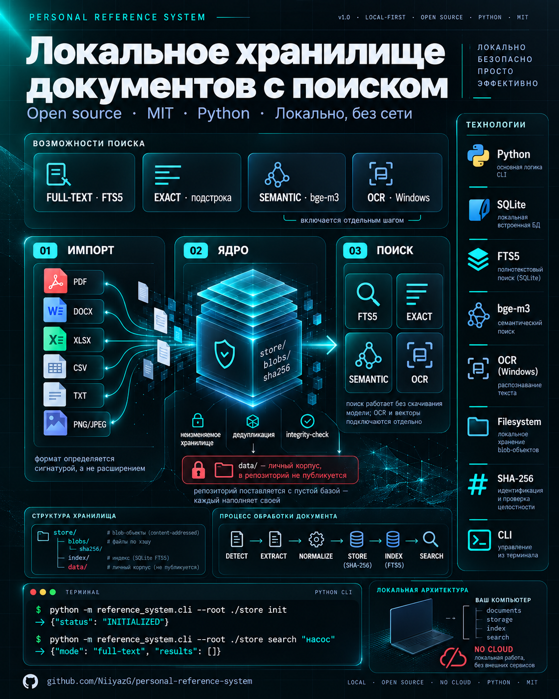

# Personal Reference System

Локальная справочно-информационная система: складывает документы в неизменяемое
хранилище, извлекает из них текст и ищет по нему. Всё работает **локально, без сети**:
ни один документ никуда не отправляется.



- **Полнотекстовый поиск** — SQLite FTS5, работает сразу после установки.
- **Точный поиск** — литеральная подстрока (удобно для кодов вида `P-101`, `DN100`).
- **Неизменяемое хранилище** — оригинал копируется по адресу `sha256`, дедупликация,
  проверка целостности.
- **Форматы** — TXT, PDF, DOCX, XLSX, CSV, TSV, PNG, JPEG.
- **OCR (Windows)** — реализовано и работает: движок Windows OCR вызывается внутри
  процесса; включается отдельным шагом (`--ocr windows`), т.к. требует пакет `winsdk`.
- **Семантический поиск** — реализовано и работает: модель `bge-m3` (int8 ONNX, CPU,
  без сети в рантайме); включается отдельным шагом, т.к. требует файлы модели.

Система устанавливается и **ищет полнотекстово/точно без скачивания модели**. OCR и
семантический поиск реализованы, но включаются отдельно — с `--ocr windows` и
`--embeddings bge-m3`.

---

## 1. Требования

- **Python 3.10+** (проверено на 3.12). Система кроссплатформенная; OCR доступен
  только в Windows.
- Обязательные пакеты перечислены в `requirements.txt` (PyMuPDF, python-docx,
  openpyxl, Pillow, charset-normalizer).
- Для OCR (Windows): пакет `winsdk` и встроенный в Windows движок распознавания.
- Для семантического поиска: `onnxruntime`, `tokenizers`, `numpy` и файлы модели
  `bge-m3` (см. раздел 5).

## 2. Установка с нуля

```bash
git clone https://github.com/NiiyazG/personal-reference-system.git
cd personal-reference-system

# рекомендуемое виртуальное окружение
python -m venv .venv
# Windows:
.venv\Scripts\activate
# Linux/macOS:
source .venv/bin/activate

pip install -r requirements.txt
```

Проверить, что всё встало:

```bash
python -m tools.security_scan                          # статический аудит, 0 findings
python -m unittest discover -s tests -p "test_*.py"    # тесты
```

## 3. Быстрый старт

Хранилище — это один каталог (по умолчанию `./data` рядом с текущим каталогом).
Создаём структуру, манифест и **пустую** базу:

```bash
python -m reference_system.cli --root data init
```

Вывод содержит `knowledge_base_id` — идентификатор вашего корпуса. База создаётся
пустой, никаких документов внутри нет.

Импорт документа и поиск:

```bash
python -m reference_system.cli --root data add "/путь/к/документу.pdf" --title "Название"
python -m reference_system.cli --root data status
python -m reference_system.cli --root data search "насос вибрирует"
python -m reference_system.cli --root data search "P-101" --exact
```

Полнотекстовый поиск по **пустой** базе безопасен — возвращается пустой список, а не
падение:

```bash
python -m reference_system.cli --root data init
python -m reference_system.cli --root data search "что угодно"
# {"query": "что угодно", "mode": "full-text", "results": []}
```

## 4. Настройка

Всё, что раньше было привязано к одной машине, настраивается. Источники значения
(от младшего к старшему, каждый следующий перекрывает предыдущий):

1. встроенные значения по умолчанию;
2. файл конфигурации JSON (`--config` или переменная `REFERENCE_CONFIG`);
3. переменные окружения `REFERENCE_*`;
4. явные аргументы командной строки.

Скопируйте пример и отредактируйте под себя:

```bash
cp reference.config.example.json reference.config.json
```

```json
{
  "root": "./data",
  "mode": "LOCAL_ONLY",
  "storage_quota": {
    "total_gib": 30,
    "live_gib": 28,
    "backup_gib": 0,
    "temporary_gib": 2,
    "minimum_free_disk_gib": 20
  },
  "ocr_engine": "none",
  "ocr_language": "ru",
  "embedding_model": "none",
  "allowed_profile": "default"
}
```

`reference.config.json` не публикуется (он в `.gitignore`) — в репозитории лежит только
пример.

| Параметр | Назначение | По умолчанию |
|---|---|---|
| `root` | каталог хранилища | `./data` (или `$REFERENCE_ROOT`) |
| `mode` | режим работы, записывается в манифест | `LOCAL_ONLY` |
| `storage_quota.total_gib` | общий предел, ГиБ | `30` |
| `storage_quota.live_gib` | основной справочник, ГиБ | `28` |
| `storage_quota.backup_gib` | резервная копия, ГиБ | `0` |
| `storage_quota.temporary_gib` | временная зона обработки, ГиБ | `2` |
| `storage_quota.minimum_free_disk_gib` | неснижаемый свободный объём диска, ГиБ | `20` |
| `ocr_engine` | движок распознавания: `none` или `windows` | `none` |
| `ocr_language` | язык распознавания | `ru` |
| `embedding_model` | модель векторов: `none` или `bge-m3` | `none` |
| `allowed_profile` | метка владельца корпуса | `default` |

Те же параметры доступны как переменные окружения (`REFERENCE_ROOT`,
`REFERENCE_MODE`, `REFERENCE_TOTAL_GIB`, `REFERENCE_LIVE_GIB`,
`REFERENCE_MINIMUM_FREE_DISK_GIB`, `REFERENCE_OCR_ENGINE`, `REFERENCE_OCR_LANGUAGE`,
`REFERENCE_EMBEDDING_MODEL`, `REFERENCE_ALLOWED_PROFILE`) и как флаги CLI
(`--root`, `--mode`, `--ocr-engine`, `--embedding-model`, `--total-gib`, `--live-gib`,
`--backup-gib`, `--temporary-gib`, `--minimum-free-disk-gib`).

## 5. Движки OCR и семантического поиска (включаются отдельно)

### 5.1. Распознавание текста (OCR) — Windows

Движок `Windows.Media.Ocr` вызывается **внутри процесса** через биндинг `winsdk`;
внешние процессы не порождаются, во время работы ничего не скачивается — модель
распознавания входит в состав Windows.

```bash
pip install winsdk

python -m reference_system.cli --root data add scan.pdf --ocr windows
python -m reference_system.cli --root data reprocess mat_... --ocr windows
python -m reference_system.cli --root data status --ocr windows   # проверить доступность
```

Страницы PDF без текстового слоя растеризуются PyMuPDF и распознаются постранично;
изображения распознаются как есть; файлы с готовым текстовым слоем не трогаются.
Результат кэшируется по содержимому (SHA-256 картинки + id, версия и язык движка),
поэтому повторный импорт и `reprocess` не запускают движок второй раз. Locator
`image-ocr` / `pdf-ocr-page` содержит `ocr_performed: true`, id и версию движка,
язык, рамки строк и `ocr_notes` — распознанный текст невозможно спутать с исходным.

Без движка поведение не меняется: из изображений индексируются только метаданные,
а «сканированный» PDF без текстового слоя отклоняется с явным сообщением.

**Измеренные ограничения движка** (на тестовых фикстурах, не по документации):

| Наблюдение | Последствие |
|---|---|
| латинские коды распознаются кириллическими двойниками: `P-101` → `Р-1О1` | поиск по латинскому коду не найдёт его в распознанном тексте; текст хранится как есть, без «исправлений» |
| слова приходят отдельными элементами без разделителей | склейка вставляет пробел, иначе выходит `вибрируетприоткрытии` |
| `OcrWord` не отдаёт уверенность | уверенность не публикуется, а не выдумывается |
| изображение больше 10 000 px | уменьшается до лимита, факт уменьшения пишется в `ocr_notes` |
| наклон, поворот, шум, плохой скан | не корректируются |

### 5.2. Семантический поиск (embeddings) — `bge-m3`

Семантический поиск идёт по векторам модели **`Xenova/bge-m3`** (int8-ONNX,
инференс `onnxruntime` на CPU, внутри процесса, без сети).

**Модель в репозиторий не входит.** Система резолвит её из локального кэша Hugging
Face обходом каталогов; клиента Hugging Face в коде нет, поэтому скачать что-либо во
время работы она не может — отсутствие модели это явная ошибка, а не тихая загрузка.
Как получить файлы модели:

```bash
pip install huggingface_hub
huggingface-cli download Xenova/bge-m3 --local-dir "$HOME/.cache/huggingface/hub/models--Xenova--bge-m3"
```

Пакеты для инференса:

```bash
pip install onnxruntime tokenizers numpy
```

Использование:

```bash
python -m reference_system.cli --root data embed --embeddings bge-m3
python -m reference_system.cli --root data search "оборудование трясётся при работе" --semantic --embeddings bge-m3
```

Векторы лежат в таблице `embedding` как float32 little-endian BLOB с SHA-256 самого
вектора; уникальность по `(fragment_id, model_version)`. `model_version` — отпечаток
файла модели, квантизации, пулинга и правила батча, поэтому векторы разных моделей
никогда не смешиваются. `embed` идемпотентен, `integrity-check` покрывает векторы.
Без модели (по умолчанию `--embeddings none`) команды `embed` и `search --semantic`
отказывают с явным сообщением, а не работают «наполовину».

Наблюдения и ограничения (см. подробнее в `SKILL.md`):

- семантический поиск находит документ по **перефразе без общих слов** (например,
  «оборудование трясётся при работе»); тот же запрос в полнотекстовом режиме даёт 0
  попаданий. Скорость — ~47 мс на короткий фрагмент после загрузки графа, первый запуск
  ~3 с;
- инференс **не бит-воспроизводим** (~1e-8): сравнивайте порогом, а не побитово;
- `batch=1` зафиксирован намеренно — динамическая квантизация смешала бы векторы
  запроса и хранилища (расхождение до ~2e-2 на компоненту);
- `search --semantic` при отсутствии векторов под эту модель **отказывает с ошибкой**, а
  не возвращает пустой список;
- `reprocess` переиндексирует векторы, иначе материал выпадает из семантического поиска.

## 6. Команды CLI

```bash
python -m reference_system.cli --root <каталог> <команда>
```

| Команда | Назначение |
|---|---|
| `init` | создать структуру, манифест, миграции и пустую базу |
| `add <файл> [--title T] [--ocr windows] [--no-images]` | импортировать файл в неизменяемое хранилище |
| `images <material_id>` | извлечь изображения из уже импортированного материала |
| `status` | счётчики, квоты, режим |
| `search <запрос> [--limit N] [--exact] [--semantic] [--images] [--min-score X]` | поиск по фрагментам |
| `show-source <fragment_id>` | вернуться к первоисточнику фрагмента |
| `reprocess <material_id> [--ocr windows]` | повторный разбор из сохранённого оригинала |
| `delete <material_id> --confirm` | необратимое удаление (резервной копии нет) |
| `embed [--limit N] [--embeddings bge-m3]` | посчитать векторы для фрагментов |
| `integrity-check` | проверка манифеста, базы, blob'ов и индексов |

Коды возврата: `0` — успех, `1` — отказ, `2` — `integrity-check` нашёл расхождения.
Вывод — JSON.

## 7. Форматы и поиск

| Формат | Что извлекается | Locator |
|---|---|---|
| TXT | нормализованный текст (BOM снят, переводы строк приведены к `\n`) | `text-lines` |
| PDF | текстовый слой; страницы без него — OCR при `--ocr windows` | `pdf-page` / `pdf-ocr-page` |
| DOCX | абзацы и ячейки таблиц | `docx-paragraph`, `docx-table-cell` |
| XLSX | значения и формулы по ячейкам | `xlsx-cell` |
| CSV / TSV | ячейки, разделитель определяется автоматически (`, ; \t |`) | `csv-cell` |
| PNG / JPEG | метаданные; при `--ocr windows` — распознанный текст | `image-file` / `image-ocr` |

Формат определяется сигнатурой и содержимым (PDF, ZIP-контейнеры, IHDR/SOF заголовки),
а не расширением. Кодировки: UTF-8 первым, затем детерминированная цепочка
`cp1251 → cp866 → koi8-r → cp1252`, и только потом эвристика `charset-normalizer` с
проверкой на текстоподобность.

**Полнотекстовый поиск** (по умолчанию) — FTS5, токенизатор `unicode61 remove_diacritics 2`.
Слова сопоставляются независимо, поэтому `насос вибрирует` найдёт фрагмент, где эти
слова не стоят рядом. Пользовательский ввод не подставляется в `MATCH` напрямую (каждое
слово — цитируемый терм), поэтому метасимволы FTS5 безопасны, а запрос без слов даёт
пустой результат, а не ошибку.

**Точный поиск** (`--exact`) — литеральная непрерывная подстрока без учёта регистра
(через `casefold`, а не SQL `LIKE`): кириллица сопоставляется независимо от регистра,
а `%` и `_` считаются обычными символами.

## 8. Гарантии и приватность

- **Неизменяемое хранилище.** Оригинал копируется в карантин, оттуда — в
  content-addressed путь `store/blobs/sha256/<2>/<sha256>` и больше не изменяется.
- **Дедупликация.** Одинаковые байты дают один blob на несколько материалов.
- **Проверка идентификаторов.** Идентификаторы с выходом за корень (`../`) отклоняются;
  рекурсивное удаление выполняется только после проверки `is_relative_to(root)`.
- **Целостность.** `integrity-check` сверяет отпечаток манифеста, `PRAGMA quick_check`,
  внешние ключи, SHA-256 blob'ов и артефактов, количество фрагментов и строк FTS.
- **Режим `LOCAL_ONLY`**, сетевых вызовов нет; текст документа считается недоверенными
  данными, а не инструкциями.
- **Резервное копирование выключено** (`backup_enabled: false`), восстановление
  невозможно — удаление необратимо и требует явного `--confirm`.
- Один процесс, запись через `BEGIN IMMEDIATE`; одновременная работа нескольких
  писателей не поддерживается.

## 9. Структура репозитория

```
personal-reference-system/
├── reference_system/        пакет системы
│   ├── foundation.py        манифест, квоты, миграции, схема
│   ├── core.py              хранилище, lifecycle, поиск, целостность
│   ├── processors.py        разбор форматов
│   ├── ocr.py, ocr_windows.py            распознавание (включается отдельно)
│   ├── embeddings.py, embeddings_onnx.py векторы (включается отдельно)
│   ├── config.py            обобщённая конфигурация
│   └── cli.py               командный интерфейс
├── schema/migrations/       SQL-миграции базы (0001..0004)
├── tests/                   модульные, интеграционные и security-тесты
├── tools/security_scan.py   статический аудит кода
├── reference.config.example.json   пример конфигурации
├── requirements.txt         зависимости
├── SKILL.md                 навык Hermes: как развернуть систему с нуля
└── LICENSE                  MIT
```

Каталог `data/` (сам корпус: манифест, база, оригиналы, кэш, векторы) в репозиторий
**не входит** и исключён в `.gitignore`.

## 10. Тесты и безопасность

```bash
python -m unittest discover -s tests -p "test_*.py"   # 218 тестов
python -m tools.security_scan                          # статический аудит, 0 findings
```

Набор покрывает миграции и сборку с нуля, все обработчики форматов, кодировки
(cp1251, cp866, BOM, CRLF, бинарный вход), разделители CSV/TSV, дедупликацию, квоты,
жизненный цикл, оба режима поиска и первоисточник, безопасность метасимволов FTS5,
повреждения (blob, FTS, манифест, путь за корнем), работу на множестве материалов,
конвейеры OCR и embeddings (на тест-двойниках и, где доступно, на реальных движках),
CLI целиком и сам статический сканер.

Статический аудит запрещает сетевые импорты, внешние процессы, динамическое
исполнение и утечки секретов; рекурсивное удаление допускается только после проверки
`is_relative_to(root)`.

## 11. Лицензия

MIT — см. файл [LICENSE](LICENSE).
